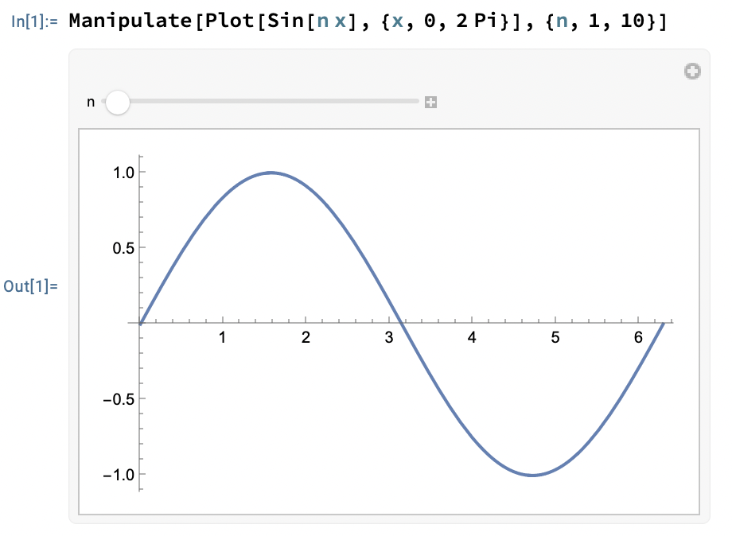

--------------------------------------------------------------------------------

How to you apply function `f` in prefix notation to the argument `x`?

. . .

```wolfram
In[1]:= f @ x
Out[1]= f[x]
```

--------------------------------------------------------------------------------

How do you apply function `f` in infix notation to the arguments `x` and `y`?

. . .

```wolfram
In[1]:= x ~f~ y
Out[1]= f[x, y]
```

--------------------------------------------------------------------------------

How do you apply function `f` in postfix notation to the argument `x`?

. . .

```wolfram
In[1]:= x // f
Out[1]= f[x]
```

--------------------------------------------------------------------------------

Apply function `Plus` to the list `{1, 2, 3}` in prefix notation.

. . .

```wolfram
In[1]:= Plus @@ {1, 2, 3}
Out[1]= 6
```

`f @@ expr` Replaces the head of `expr` by `f`.
It's the same as `Apply[f, expr]`.

--------------------------------------------------------------------------------

Map function `f` over list `{1, 2, 3}` in prefix notation.

. . .

```wolfram
In[1]:= f /@ {1, 2, 3}
Out[1]= {f[1], f[2], f[3]}
```

It's the same as `Map[f, {1, 2, 3}]`.

--------------------------------------------------------------------------------

Apply first function `f` and then function `g` to list `{1, 2, 3}`
as a pipeline (aka chain of prefix notation).

. . .

In[1]:= {1, 2, 3} //
          Map[f,#]& //
 	        Map[g,#]&
Out[1]= {g[f[1]], g[f[2]], g[f[3]]}

--------------------------------------------------------------------------------

How do you write multi-line strings?

. . .

Including the newline:

```wolfram
In[1]:= "Hello
        World"
Out[1]= "Hello
        World"
```

Without the newline:

```wolfram
In[1]:= "Hello \
        World"
Out[1]= "Hello World"
```

--------------------------------------------------------------------------------

Get the 8th prime number.

. . .

```wolfram
In[1]:= Prime[8]

Out[1]= 19
```

--------------------------------------------------------------------------------

How do you create a list?

. . .

```wolfram
In[1]:= {1, 2, 3}

Out[1]= {1, 2, 3}
```

--------------------------------------------------------------------------------

What is the basic syntax for defining a function?

. . .

```wolfram
In[1]:= f[x_] := expression
```

--------------------------------------------------------------------------------

Define a pure function that squares its input and apply it to 3.

. . .

```wolfram
In[1]:= #^2 &[3]

Out[1]= 9
```

--------------------------------------------------------------------------------

Create a 2D plot of the function $f(x) = sin(x)$ in the range $0$ to $20$

. . .

```wolfram
In[1]:= Plot[Sin[x], {x, 0, 20}]

Out[1]= -Graphics-
```

--------------------------------------------------------------------------------

Find the eigenvalues of a matrix.

. . .

```wolfram
In[1]:= Eigenvalues[{{1.1, 2.2, 3.25}, {0.76, 4.6, 5}, {0.1, 0.1, 6.1}}]

Out[1]= {6.60674, 4.52536, 0.667901}
```

--------------------------------------------------------------------------------

How can you compute the sum of the series
$sum_{n=1}^{\infty} \frac{1}{n^2}$?

. . .

```wolfram
In[1]:= Sum[1/n^2, {n, 1, Infinity}]

          2
        Pi
Out[1]= ---
         6
```

--------------------------------------------------------------------------------

Create a simple plot of $sin(x)$.

. . .

```wolfram
In[1]:= Plot[Sin[x], {x, 0, 2 Pi}]

Out[1]= -Graphics-
```

--------------------------------------------------------------------------------

Define the function $f(x) = x^2 + 3x + 2$.

. . .

```wolfram
In[1]:= f[x_] := x^2 + 3x + 2
```

--------------------------------------------------------------------------------

What function would you use
to find the derivative of $x^3 + x$ with respect to $x$?

. . .

```wolfram
In[1]:= D[x^3 + x, x]
               2
Out[8]= 1 + 3 x
```

--------------------------------------------------------------------------------

Solve the equation $x^2 - 4 = 0$ for $x$?

. . .

```wolfram
In[1]:= Solve[x^2 - 4 == 0, x]

Out[1]=  {{x -> -2}, {x -> 2}}
```

--------------------------------------------------------------------------------

What command gives you the numerical value of `Pi` to 20 decimal places?

. . .

```wolfram
In[1]:= N[Pi, 20]

Out[1]= 3.1415926535897932385
```

--------------------------------------------------------------------------------

Which function would you use to create a list of the first 10 squares?

. . .

```wolfram
In[1]:= Table[n^2, {n, 1, 10}]

Out[1]= {1, 4, 9, 16, 25, 36, 49, 64, 81, 100}
```

--------------------------------------------------------------------------------

What function computes the mean of the list {1, 2, 3, 4, 5}?

. . .

```wolfram
In[1]:= Mean[{1, 2, 3, 4, 5}]

Out[1]= 3
```

--------------------------------------------------------------------------------

How can you create a 3x3 identity matrix?

. . .

```wolfram
In[1]:= IdentityMatrix[3]

Out[1]= {{1, 0, 0}, {0, 1, 0}, {0, 0, 1}}
```

--------------------------------------------------------------------------------

What command would give you the infinitive integral of `sin(x)`?

. . .

```wolfram
In[1]:= Integrate[Sin[x], x]

Out[1]= -Cos[x]
```

--------------------------------------------------------------------------------

What function would you use
to generate 5 random real numbers between 0 and 1?

. . .

```wolfram
In[1]:= RandomReal[{0, 1}, 5]

Out[1]= {0.922358, 0.615876, 0.167268, 0.500676, 0.44714}
```

--------------------------------------------------------------------------------

Produce a 2D plot of the parametric equations $x = cos(t)$ and $y = sin(t)$.

. . .

```wolfram
In[1]:= ParametricPlot[{Cos[t], Sin[t]}, {t, 0, 2 Pi}]

Out[1]= -Graphics-
```

--------------------------------------------------------------------------------

What is the function to compute the Fourier transform of $f(t) = Exp[-t^2]$?

. . .

```wolfram
In[1]:= FourierTransform[Exp[-t^2], t, w]

              1
Out[1]= -------------
                  2
                 w /4
        Sqrt[2] E
```

--------------------------------------------------------------------------------

Create a polynomial $5x^3 + 2x^2 + x - 7$?

. . .

```wolfram
In[1]:= 5x^3 + 2x^2 + x - 7

                    2      3
Out[1]= -7 + x + 2 x  + 5 x
```

--------------------------------------------------------------------------------

Find the greatest common divisor of $56$ and $98$.

. . .

```wolfram
In[1]:= GCD[56, 98]

Out[1]= 14
```

--------------------------------------------------------------------------------

Simplify the expression $(x^2 - 1)/(x - 1)$?

. . .

```wolfram
In[1]:= Simplify[(x^2 - 1)/(x - 1)]

Out[1]= 1 + x
```

--------------------------------------------------------------------------------

What command plots $x^2$ and $2x + 1$ on the same graph?

. . .

```wolfram
In[1]:= Plot[{x^2, 2x + 1}, {x, -2, 2}]

Out[1]= -Graphics-
```

--------------------------------------------------------------------------------

How can you find the numerical solution to the equation $x^2 + x - 1 = 0$?

. . .

```wolfram
In[1]:= NSolve[x^2 + x - 1 == 0, x]

Out[1]= {{x -> -1.61803}, {x -> 0.618034}}
```

--------------------------------------------------------------------------------

What command gives you the prime factors of 315?

. . .

```wolfram
In[1]:= FactorInteger[315]

Out[1]=  {{3, 2}, {5, 1}, {7, 1}}
```

--------------------------------------------------------------------------------

What function would you use to create a simple plot of $sin(x)$?

. . .

```wolfram
In[1]:= Plot[Sin[x], {x, 0, 2 Pi}]

Out[1]= -Graphics-
```

--------------------------------------------------------------------------------

What function would you use
to find the derivative of $x^3 + x$ with respect to $x$?

. . .

```wolfram
In[1]:= D[x^3 + x, x]

               2
Out[1]= 1 + 3 x
```

--------------------------------------------------------------------------------

How do you apply the function `f` to each element of a list?

. . .

```wolfram
In[1]:= Map[f, {1, 2, 3}]

Out[1]= {f[1], f[2], f[3]}
```

--------------------------------------------------------------------------------

How do you perform matrix multiplication?

. . .

```wolfram
In[1]:= {1, 2, 3} . {1, 2, 3}

Out[1]= 14
```

--------------------------------------------------------------------------------

How do you generate a list or array of values based on an iterative process?

. . .

```wolfram
In[1]:= Table[exp, {i, 1, 5}]

Out[1]=  {exp, exp, exp, exp, exp}
```

--------------------------------------------------------------------------------

How do you perform a fourier transform?

. . .

```wolfram
In[1]:= Fourier[]

Out[1]=
```

--------------------------------------------------------------------------------

How do you removes nested lists, creating a single-level list?

. . .

```wolfram
In[1]:= Flatten[{{1, 2}, {3, 4}}]

Out[1]= {1, 2, 3, 4}
```

--------------------------------------------------------------------------------

How do you create a random integer between 1 and 10?

. . .

```wolfram
In[1]:= RandomInteger[{1, 10}]

Out[1]= 6
```

--------------------------------------------------------------------------------

How do you find symbolic solutions to equations or systems of equations?

. . .

```wolfram
In[1]:= Solve[x^2 == 4, x]

Out[1]= {{x -> -2}, {x -> 2}}
```

--------------------------------------------------------------------------------

How do you create a plot of the function $f(x) = sin(x)$?

. . .

```wolfram
In[1]:= Plot[Sin[x], {x, 0, 2Pi}]

Out[1]= -Graphics-
```

--------------------------------------------------------------------------------

How do you concatenate strings together?

. . .

```wolfram
In[1]:= StringJoin["Hello", " ", "World"]

Out[1]= Hello World
```

of

```wolfram
In[1]:= "Hello" <> " " <> "World"

Out[1]= Hello World
```

--------------------------------------------------------------------------------

How do you find the length of a list?

. . .

```wolfram
In[1]:= Length[{1, 2, 3}]

Out[1]= 3
```

--------------------------------------------------------------------------------

How do you numerically solve differential equations

. . .

```wolfram
In[1]:= NDSolve[{y'[x] == y[x], y[0] == 1}, y, {x, 0, 10}]

Out[1]= {{y -> InterpolatingFunction[{{0., 10.}}, <>]}}
```

--------------------------------------------------------------------------------

How do you create a 3D plot?

. . .

```wolfram
In[1]:= Plot3D[x^2 + y^2, {x, -2, 2}, {y, -2, 2}]

Out[1]= -Graphics3D-
```

--------------------------------------------------------------------------------

How do you swap rows and columns of a matrix?

. . .

```wolfram
In[1]:= Transpose[{{1, 2, 3}, {4, 5, 6}}]

Out[1]= {{1, 4}, {2, 5}, {3, 6}}
```

--------------------------------------------------------------------------------

How do you find the inverse of a matrix?

. . .

```wolfram
In[1]:= Inverse[{{1, 2}, {3, 4}}]

                    3    1
Out[1]= {{-2, 1}, {-, -(-)}}
                    2    2
```

--------------------------------------------------------------------------------

How do you perform a symbolic integration?

. . .

```wolfram
In[1]:= Integrate[x^2 + Sin[x], x]

          3
         x
Out[1]= -- - Cos[x]
         3
```

--------------------------------------------------------------------------------

How do you create a histogram?

. . .

```wolfram
In[1]:= Histogram[{1,1,2,3}, 5]

Out[1]= -Graphics-
```

Attention:
You must use a bin size larger than the number of unique elements in the list.

--------------------------------------------------------------------------------

How do you apply the function `f` repeatedly to an expression?

. . .

```wolfram
In[1]:= Nest[f, x, 3]

Out[1]= f[f[f[x]]]
```

--------------------------------------------------------------------------------

How do you find the eigenvalues of a matrix?

. . .

```wolfram
In[1]:= Eigenvalues[{{1, 2}, {3, 4}}]

         5 + Sqrt[33]  5 - Sqrt[33]
Out[1]= {------------, ------------}
              2             2
```

--------------------------------------------------------------------------------

How do you create interactive interfaces with adjustable parameters?

. . .

```wolfram
In[1]:= Manipulate[Plot[Sin[n x], {x, 0, 2 Pi}], {n, 1, 10}]
```



--------------------------------------------------------------------------------

How do you import data from a CSV file?

. . .

```wolfram
In[1]:= Import["source/users.csv"]

Out[1]= {{name, color}, {John, blue}, {Lisa, red}, {Chris, green}}
```

--------------------------------------------------------------------------------

How do you count occurrences of each distinct element in a list?

. . .

```wolfram
In[1]:= Tally[{1, 2, 2, 3, 4}]

Out[1]= {{1, 1}, {2, 2}, {3, 1}, {4, 1}}
```

--------------------------------------------------------------------------------

How do you create and apply a pure function that squares its input?

. . .

```wolfram
In[1]:= #1^2 &[7]

Out[1]= 49
```

--------------------------------------------------------------------------------

How do you apply a function cumulatively to a list of elements?

. . .

```wolfram
In[1]:= Fold[f, {a, b, c, d}]

Out[1]= f[f[f[a, b], c], d]
```

--------------------------------------------------------------------------------

How do you find the roots of a polynomial?

. . .

```wolfram
In[1]:= Solve[x^2 - 4 == 0, x]

Out[1]= {{x -> -2}, {x -> 2}}
```

--------------------------------------------------------------------------------

How do you extract elements from a list that match a specified pattern?

. . .

```wolfram
In[1]:= Cases[{1, 2, 3, 4, 5}, _?EvenQ]

Out[1]= {2, 4}
```

--------------------------------------------------------------------------------

How do you create an animated plot?

. . .

```wolfram
In[1]:= Animate[Plot[Sin[n x], {x, 0, 2 Pi}], {n, 1, 10}]

Out[1]= Manipulate[
  Plot[Sin[n x], {x, 0, 2 Pi}],
  {n, 1, 10,
    AppearanceElements -> {
      ProgressSlider,
      PlayPauseButton,
      FasterSlowerButtons,
      DirectionButton
    }
  },
  ControlType -> Animator,
  AppearanceElements -> None,
  DefaultBaseStyle -> Animate,
  DefaultLabelStyle -> AnimateLabel,
  SynchronousUpdating -> True,
  ShrinkingDelay -> 10.
]
```

--------------------------------------------------------------------------------

How do you collect values generated during a computation?

. . .

```wolfram
In[1]:= Reap[
  Do[
    If[PrimeQ[n], Sow[n]],
    {n, 1, 10}
  ]
]

Out[1]= {Null, {{2, 3, 5, 7}}}
```

--------------------------------------------------------------------------------

How do you perform symbolic differentiation?

. . .

```wolfram
In[1]:= D[x^2 + Sin[x], x]

Out[1]= 2 x + Cos[x]
```

--------------------------------------------------------------------------------

How do you generate all possible combinations of elements from given lists?

. . .

```wolfram
In[1]:= Tuples[{{a, b}, {1, 2, 3}}]

Out[1]= {{a, 1}, {a, 2}, {a, 3}, {b, 1}, {b, 2}, {b, 3}}
```

--------------------------------------------------------------------------------

How do you solve a system of linear equations?

. . .

```wolfram
In[1]:= Solve[{x + y == 3, x - y == 1}, {x, y}]

Out[1]= {{x -> 2, y -> 1}}
```

```wolfram
In[1]:= LinearSolve[{{1, 1}, {1, -1}}, {3, 1}]

Out[1]= {2, 1}
```

--------------------------------------------------------------------------------

How do you generate a list of results from repeated application of a function?

. . .

```wolfram
In[1]:= NestList[f, x, 3]

Out[1]= {x, f[x], f[f[x]], f[f[f[x]]]}
```

--------------------------------------------------------------------------------

How do you create a word cloud?

. . .

```wolfram
In[1]:= WordCloud[{"apple", "banana", "apple", "cherry", "banana"}]

Out[1]= -Graphics-
```

--------------------------------------------------------------------------------

How do you removes duplicate elements from a list?

. . .

```wolfram
In[1]:= DeleteDuplicates[{1, 2, 2, 3, 4}]

Out[1]= {1, 2, 3, 4}
```

--------------------------------------------------------------------------------

How do you perform numerical integration?

. . .

```wolfram
In[1]:= NIntegrate[x^2 + Sin[x], {x, 0, Pi}]

Out[1]= 12.3354
```

--------------------------------------------------------------------------------

What function is used to solve differential equations?

. . .

```wolfram
In[1]:= DSolve[y'==y]

Out[1]= {{y->Function[{\[FormalX]},E^\[FormalX] Subscript[\[ConstantC], 1]]}}
```

--------------------------------------------------------------------------------

Create an association for 1 to one and 2 to two.

. . .

```wolfram
<| 1 -> "one", 2 -> "two"|>
```

--------------------------------------------------------------------------------

Update the value of 2 in following association to "dos":
```wolfram
wordMap = <|1 -> "one", 2 -> "two"|>
```

. . .

```wolfram
ReplacePart[wordMap, 2 -> "dos"]
```

**Note:**
`ReplacePart` has no effect if the key is not present in the association.

--------------------------------------------------------------------------------

Import a CSV of words and their translations,
take the first 5 words after the header and make them upper case.
Use a pipeline style for the transformations.

. . .

```wolfram
In[1]:= Import["words.csv"][[2;;6]] //
          Map[First,#]& //
          Map[ToUpperCase,#]&
Out[1]= {"APPLE", "BANANA", "CHERRY", "PEAR", "ELDERBERRY"}
```

--------------------------------------------------------------------------------

Get a country entity from a country string

. . .

```wolfram
In[1]:= Interpreter["Country"]["USA"]

Out[1]= Entity["Country", "UnitedStates"]
```


--------------------------------------------------------------------------------

Get a color representation from a color name

. . .

```wolfram
In[1]:= Interpreter["Color"]["blue"]

Out[1]= RGBColor[0, 0, 1]
```


--------------------------------------------------------------------------------

Write a function `greet` to insert a name into a greeting phrase

. . .

```wolfram
greet = StringTemplate["Hello ``, how are you?"]
```

--------------------------------------------------------------------------------

Export a JSON object to `fruits.json` with a mapping of fruits to their colors:

. . .

```wolfram
In[1]:= Export["fruits.json", {
          "banana" -> "yellow",
          "cherry" -> "red",
        }]
Out[1]= fruits.json
```

or

```wolfram
In[1]:= Export["fruits.json", <|
          "banana" -> "yellow",
          "cherry" -> "red",
        |>]
Out[1]= fruits.json
```
