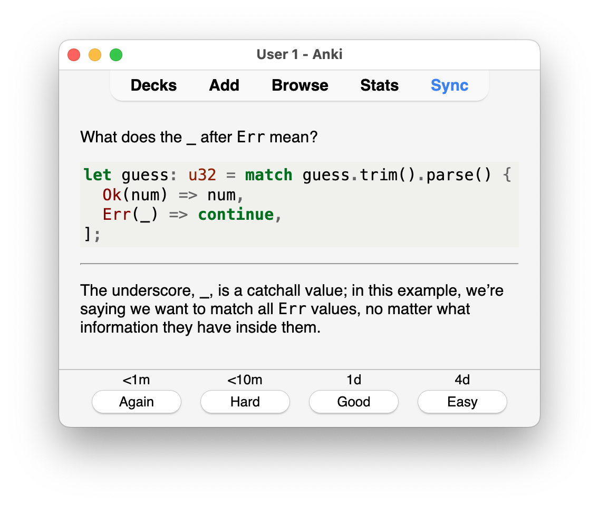

# Coding Flashcards

Over 800 flashcards to learn programming from first principles.
Written in markdown with script to convert them to Anki decks or PDF files.

## Available Languages

- [Rust](./rust)
- [SQLite](./sqlite)
- [Godot](./godot)
- [Wolfram Language](./wolfram-language)
- [Lua](./lua)

## Downloads

Prebuilt Anki decks (`.apkg`) and PDFs for each language,
as well as a combined deck containing all languages,
are attached to every tagged release on the
[releases page](https://github.com/ad-si/Coding-Flashcards/releases).
